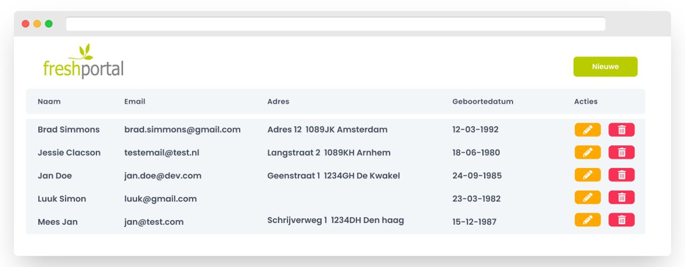

# Opdracht

De volgende opdracht is bedoeld om inzicht te krijgen in je kennis van programmeertalen. Probeer zo veel mogelijk punten vna deze opdracht af te maken. In deze opdracht maak je een
CRUD (Created, Read, Update en Delete) API en de front end die er bij hoort. Om gegevens in de database te kunnen bewerken, verwijderen en tonen op een web pagina.

Maak een database schema aan met een `employee` table er in. Voeg aan deze tabel de volgende velden toe: `id`, `firstname`, `lastname`, `email`, `address`, en `birthdate`
(je mag zelf ook velden bijvoegen). Voorzie deze table van minimaal 5 dummy regels. Zorg ervoor dat je met PHP verbinding kan maken met de database.

Maak een API route om alle employees op te halen. Roep vanuit de view deze api en geef de employees weer in een HTML tabel.

Maak een API route om een employee aan te maken en een formulier in de view om een gebruiker aan te maken.
Dit formulier moet een veld hebben voor de `voornaam`, `achternaam`, `email`, `adress`, enzo.

Maak een API route om een bestaande employee te kunnen bewerken. Pas het bestaand formulier aan om een bestaande employee te kunnen bewerken.

## Extra

Een email van een employee moet uniek zijn. Voeg deze restrictie toe aan de database en zorg dat de gebruiker een mooie melding krijgt als je nog een gebruiker wil toevoegen met
dezelfde email

Zorg ervoor dat je applicatie geen SQL injectie heeft.

Je mag UI libraries zoals Bootstrap gebruiken.

Hieronder een voorbeeld van hoe het er uit zou kunnen zien:

